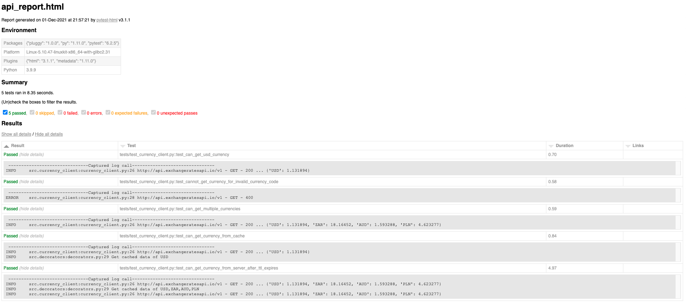

# Setup Guide

## Install Docker
    https://docs.docker.com/get-docker/

## Clone currency_client GIT Repository:
    git clone https://github.com/jacqueswest/currency_client.git

## How to generate an Access key and add to the environment file
    1. Create a free account on https://exchangeratesapi.io/pricing/
    2. Signup with the free plan
    3. Login with the created credentials
    4. Navigate to the dashboard
    5. Copy the API Access Key
    6. From the root of this repo open the [.env] file in an editor
    7. Replace the text "PASTE ACCESS KEY HERE" with the gnenerate access key
    8. Save and close the file
    

## Executing Tests with docker:
    docker-compose run --rm currency-client-tests pytest

## Output Example:
    tests/test_currency_client.py::test_can_get_usd_currency PASSED                                                                                                                                                                     [ 20%]
    tests/test_currency_client.py::test_cannot_get_currency_for_invalid_currency_code PASSED                                                                                                                                            [ 40%]
    tests/test_currency_client.py::test_can_get_multiple_currencies PASSED                                                                                                                                                              [ 60%]
    tests/test_currency_client.py::test_can_get_currency_from_cache PASSED                                                                                                                                                              [ 80%]
    tests/test_currency_client.py::test_can_get_currency_from_server_after_ttl_expires PASSED

## Viewing Test Report:            
  A report called **_api_report.html_** will be created in the root of the repository after test execution.

# Viewing Log Files:
A **_logs_** folder will be created in the root of the repository during test execution.

  
  Copy the full path of the report and open it in a browser or in a HTML viewer to view the report.
  
  Example of API HTML test report:

